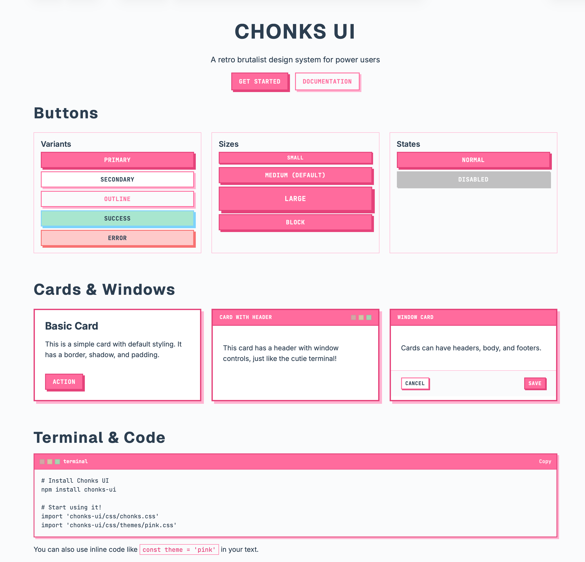

# Chonks UI

A retro brutalist design system for power users. Built with simplicity, consistency, and swappable themes in mind.



## Features

- **Retro Brutalist Aesthetic** - Sharp corners, offset shadows, and bold borders
- **Swappable Color Palettes** - Easily switch between pink, blue, purple, green, and greyscale themes
- **Plain HTML/CSS** - Use it without any build tools
- **React Components** - Full component library for React apps
- **Monospace Typography** - JetBrains Mono for that terminal vibe
- **Zero Dependencies** - Pure CSS and React, no bloat
- **Accessibility Features** - Focus management, keyboard navigation, and ARIA support
- **Responsive Design** - Mobile-first with proper scaling
- **Privacy First** - No tracking, no data collection, works offline

## Inspiration

Chonks UI is inspired by:
- Classic terminal interfaces
- Retro computing aesthetics
- Brutalist web design
- The apps in this repo: `cutie` (pink theme) and `bops.to` (blue theme)

## Installation

### NPM (Recommended)

```bash
npm install chonks-ui
```

```html
<!-- In your HTML -->
<link rel="stylesheet" href="node_modules/chonks-ui/css/chonks.css">
<link rel="stylesheet" href="node_modules/chonks-ui/css/themes/pink.css">
```

### CDN (No Build Tools)

```html
<!DOCTYPE html>
<html>
<head>
    <!-- Main CSS -->
    <link rel="stylesheet" href="https://unpkg.com/chonks-ui@latest/css/chonks.css">
    
    <!-- Pick a theme -->
    <link rel="stylesheet" href="https://unpkg.com/chonks-ui@latest/css/themes/pink.css">
</head>
<body>
    <div class="chonks-container">
        <h1 class="chonks-h1 chonks-display">Hello World</h1>
        <button class="chonks-btn">Click Me</button>
    </div>
</body>
</html>
```

[📖 Getting Started Guide](./docs/getting-started.md) | [🤝 Contributing](./CONTRIBUTING.md) | [🔒 Security](./SECURITY.md)

### React

```jsx
import {
  Button,
  Card,
  Terminal,
  useTheme,
  THEMES
} from 'chonks-ui-react'

function App() {
  // Apply theme
  useTheme(THEMES.PINK)

  return (
    <div className="chonks-container">
      <h1 className="chonks-h1 chonks-display">Hello World</h1>
      <Button>Click Me</Button>

      <Card>
        <Terminal title="terminal">
          <pre>npm install chonks-ui-react</pre>
        </Terminal>
      </Card>
    </div>
  )
}
```

## Available Themes

Chonks UI comes with 5 pre-built color themes:

- **Pink** (`themes/pink.css`) - Inspired by the cutie app
- **Blue** (`themes/blue.css`) - Inspired by bops.to
- **Purple** (`themes/purple.css`) - A vibrant purple scheme
- **Green** (`themes/green.css`) - A fresh green scheme
- **Greyscale** (`themes/greyscale.css`) - Classic monochrome aesthetic

### Switching Themes

**Plain HTML/CSS:**
```html
<!-- Just change the theme CSS import -->
<link rel="stylesheet" href="path/to/themes/blue.css">
```

**React:**
```jsx
import { useTheme, THEMES } from 'chonks-ui-react'

function App() {
  const [theme, setTheme] = useState(THEMES.PINK)
  useTheme(theme)

  return (
    <button onClick={() => setTheme(THEMES.BLUE)}>
      Switch to Blue
    </button>
  )
}
```

## Components

### Available Components

#### HTML/CSS Classes
- `.chonks-btn` - Buttons
- `.chonks-card` - Cards/Windows
- `.chonks-terminal` - Terminal/Code blocks
- `.chonks-input` - Text inputs
- `.chonks-select` - Dropdown selects
- `.chonks-checkbox` - Checkboxes
- `.chonks-radio` - Radio buttons
- `.chonks-badge` - Badges
- `.chonks-spinner` - Loading spinners
- `.chonks-alert` - Alert messages

#### React Components
- `<Button />` - Interactive buttons
- `<Card />`, `<CardHeader />`, `<CardBody />`, `<CardFooter />` - Card layouts
- `<Terminal />`, `<Code />` - Terminal and code display
- `<Input />`, `<Textarea />`, `<InputGroup />`, `<Label />` - Text inputs
- `<Select />` - Dropdown selects
- `<Checkbox />`, `<CheckboxGroup />` - Checkboxes
- `<Radio />`, `<RadioGroup />` - Radio buttons
- `<Badge />` - Status badges
- `<Spinner />`, `<Loading />` - Loading states
- `<Alert />` - Notifications
- `<WindowControls />` - macOS-style window controls

#### CSS-Only Components
- Modal dialogs with backdrop and focus management
- Toast notifications with auto-dismiss
- Tabbed interfaces with keyboard navigation
- Tooltips with positioning variants
- Progress bars with determinate/indeterminate modes
- Skeleton loaders for content placeholders

## Typography

Chonks UI uses three font families:
- **Inter** - Body text (sans-serif)
- **Geist** - Display text (sans-serif)
- **JetBrains Mono** - Code and monospace text

Font classes:
- `.chonks-display` - Display text (uppercase, bold, mono)
- `.chonks-mono` - Monospace text
- `.chonks-h1`, `.chonks-h2`, `.chonks-h3`, `.chonks-h4` - Headings
- `.chonks-text-sm`, `.chonks-text-base`, `.chonks-text-lg`, `.chonks-text-xl` - Text sizes

## Design Tokens

All colors and styles are controlled via CSS custom properties:

```css
:root {
  /* Primary Colors */
  --chonks-primary: #87CEEB;
  --chonks-primary-dark: #4682B4;
  --chonks-primary-light: #B0E0E6;

  /* Neutral Colors */
  --chonks-surface: #FFFFFF;
  --chonks-background: #F8FAFB;
  --chonks-text: #2C3E50;

  /* Spacing */
  --chonks-space-xs: 4px;
  --chonks-space-sm: 8px;
  --chonks-space-md: 16px;
  --chonks-space-lg: 24px;
  --chonks-space-xl: 32px;

  /* Shadows */
  --chonks-shadow-sm: 2px 2px 0;
  --chonks-shadow-md: 4px 4px 0;
  --chonks-shadow-lg: 6px 6px 0;
}
```

## Creating Custom Themes

Create your own theme by overriding the CSS custom properties:

```css
/* my-custom-theme.css */
:root {
  --chonks-primary: #ff00ff;
  --chonks-primary-dark: #cc00cc;
  --chonks-primary-light: #ff99ff;
}
```

Then import it after the main CSS:
```html
<link rel="stylesheet" href="chonks.css">
<link rel="stylesheet" href="my-custom-theme.css">
```

## Utility Classes

Chonks UI includes utility classes for spacing, layout, and more:

```html
<!-- Spacing -->
<div class="chonks-p-md chonks-m-lg"></div>
<div class="chonks-mb-xl chonks-mt-sm"></div>

<!-- Layout -->
<div class="chonks-flex chonks-gap-md chonks-items-center"></div>
<div class="chonks-flex chonks-justify-between"></div>

<!-- Text -->
<div class="chonks-text-center"></div>
<div class="chonks-text-left"></div>

<!-- Width -->
<div class="chonks-w-full"></div>

<!-- Container -->
<div class="chonks-container"></div>
```

## Examples

Check out the examples directory for complete demos:
- `/examples/html/index.html` - Plain HTML/CSS example
- `/examples/react/App.jsx` - React example with theme switching

## File Structure

```
chonks-ui/
├── css/
│   ├── chonks.css           # Main CSS file
│   └── themes/
│       ├── pink.css         # Pink theme
│       ├── blue.css         # Blue theme
│       ├── purple.css       # Purple theme
│       └── green.css        # Green theme
├── react/
│   ├── package.json
│   └── src/
│       ├── index.js         # Main export
│       ├── components/      # React components
│       └── hooks/           # React hooks
├── examples/
│   ├── html/               # HTML examples
│   └── react/              # React examples
└── docs/                   # Documentation
```

## Browser Support

Chonks UI works in all modern browsers that support CSS custom properties:
- Chrome/Edge 88+
- Firefox 89+
- Safari 14+

## License

MIT

## Contributing

This is a personal design system, but feel free to fork and customize for your own projects!

## Credits

Created by Cory Wilkerson

Inspired by the aesthetic of terminal interfaces, retro computing, and brutalist web design.
